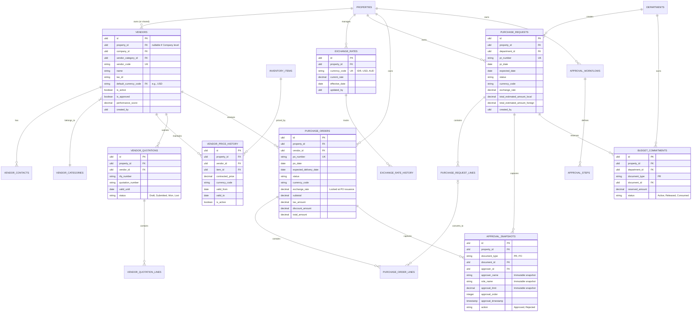

# Purchasing Database Design

## 7. Entity Relationship Diagram (ERD)

Desain skema database berikut dirancang untuk IVORQ Enterprise dengan prinsip: 
1. **Property Isolation** (`property_id` pada setiap tabel).
2. **Auditability** (`created_by`, `updated_by`).
3. **Data Integrity** (Strict Foreign Keys, Soft Deletes).

### Architecture Refinement v2
Telah diperbarui untuk menyertakan `vendor_price_history`, `vendor_quotations`, `exchange_rates`, dan `approval_snapshots` guna memenuhi standar *Oracle OPERA Cloud* dan *Materials Control*.

### Table Specifications

#### 1. Primary Keys (PK) & Data Types
Seluruh PK menggunakan format `ULID` 26-karakter string (`01ARZ3NDEKTSV4RRFFQ69G5FAV`). Mencegah ID enumerasi dan krusial untuk sinkronisasi _offline-to-online_.

#### 2. Foreign Keys (FK) & Constraints
Seluruh FK dilindungi constraint DB ketat. Penghapusan referensi menggunakan mode `RESTRICT` pada data transaksional, dan mode `CASCADE` pada relasi komposit (misal: Hapus `PurchaseOrder` otomatis menghapus `PurchaseOrderLines`).

#### 3. Indexes & Unique Keys
- **Unique**: `(property_id, vendor_code)`, `(property_id, pr_number)`, `(property_id, po_number)`.
- **B-Tree Indexes**: Pada kolom _filtering_ intensif seperti `status`, `pr_date`, `department_id`, dan `vendor_id`.

#### 4. Audit Fields (HasAuditColumns)
Seluruh tabel transaksi dan master menyertakan `created_by`, `updated_by`, `created_at`, `updated_at`, dan `deleted_at`.

#### 5. Property Isolation
Global Scope `addGlobalScope('property')` menjamin isolasi data mutlak antar properti.
