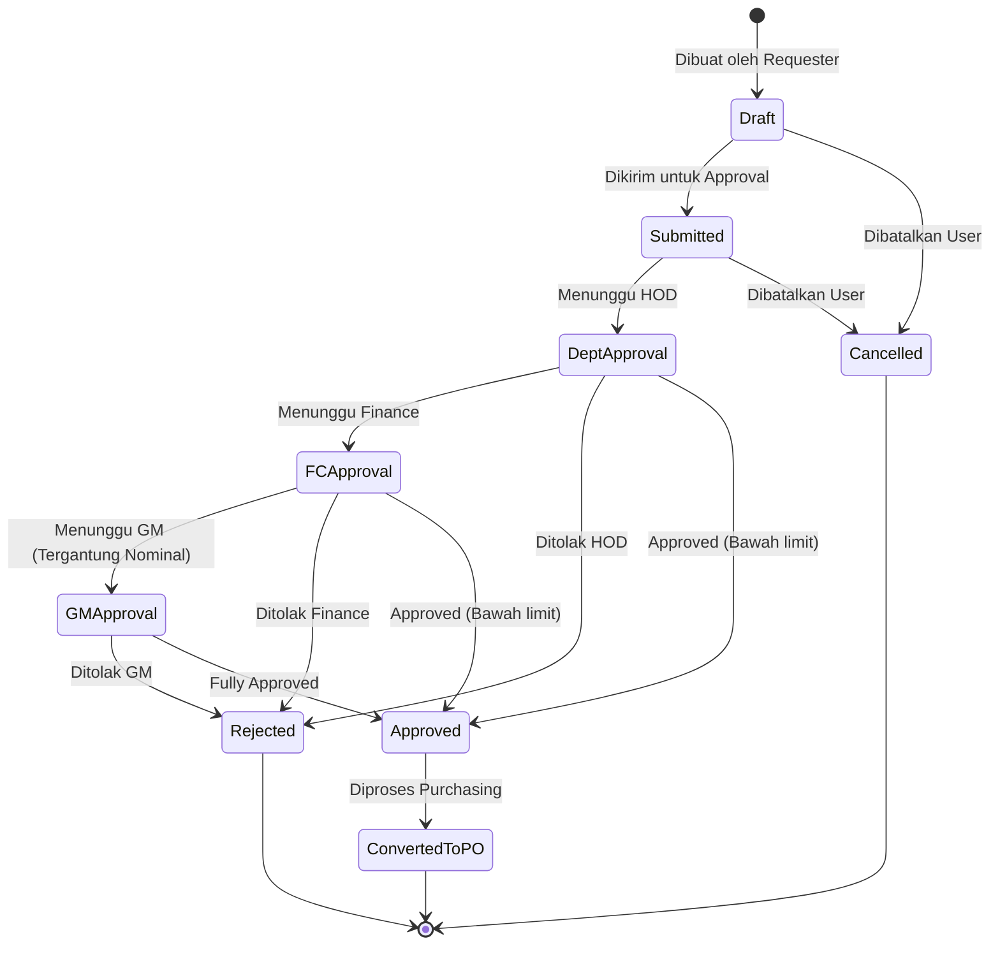
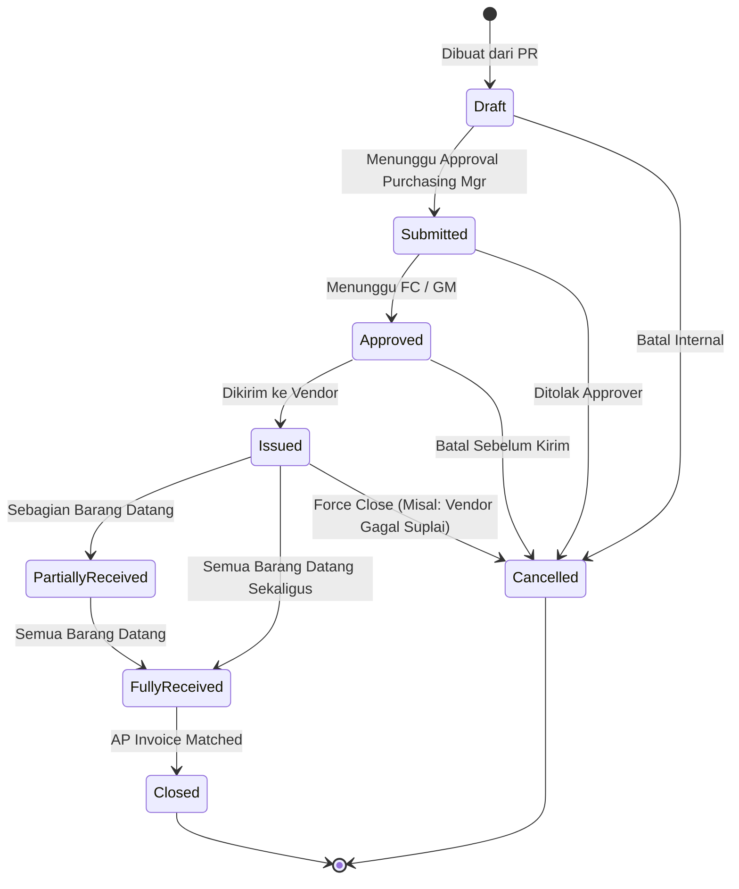

# Purchasing Workflow Architecture

## 3. Purchase Request (PR) Architecture

_Purchase Request_ (PR) atau Permintaan Pembelian adalah dokumen inisiasi dari departemen (_Requester_) ke departemen Purchasing.

### PR Workflow Lifecycle

### Business Rules
- **Item Origin**: Baris PR (_Lines_) dapat mengambil barang dari *Item Master* (InventoryItem) atau barang *Non-Inventory/Direct Issue* (Misal: Servis, Jasa).
- **Consolidation**: Purchasing dapat menggabungkan (konsolidasi) beberapa baris PR dari departemen berbeda ke dalam satu PO yang sama untuk Vendor yang sama (mendapatkan diskon kuantitas).
- **Split PO**: Satu PR dapat dipecah menjadi beberapa PO jika barang-barangnya harus dipesan dari Vendor yang berbeda.

### Approval Rules
- PR tidak akan bisa diubah (dikunci) ketika statusnya bergerak dari `Draft` ke `Submitted`.
- Pembatalan PR hanya bisa dilakukan jika status belum `Converted To PO` dan belum seluruhnya di-_approve_.
- Alur _Approval_ bersifat sekuensial (harus urut dari bawah ke atas) berdasar hierarki Matrix.

### Budget Rules
- Saat PR `Submitted`, nominal *Estimated Cost* dikalkulasi dan di-_reserve_ dari *Budget Department* bulan berjalan.
- Jika anggaran tidak cukup, sistem menandai PR sebagai `Over Budget` dan mengharuskan _Approval_ khusus dari Financial Controller.

### Audit Rules
- Semua perubahan pada baris PR (sebelum `Submitted`) terlacak oleh `AuditObserver`.
- `AuditObserver` juga merekam *IP Address* dan *User ID* setiap penyetuju (_Approver_).

---

## 4. Purchase Order (PO) Architecture

_Purchase Order_ (PO) adalah dokumen mengikat secara legal dari Hotel kepada Vendor untuk menyuplai barang/jasa.

### PO Workflow Lifecycle

### Business Rules
- **Pricing**: Harga di PO bersifat mengikat (_Fixed_). Jika harga berubah saat penerimaan, maka harus menggunakan prosedur revisi PO atau persetujuan selisih harga (_Price Variance Approval_).
- **Tax & Discount**: PO wajib mencantumkan konfigurasi PPN (Inclusive/Exclusive), Diskon (Persentase/Nominal), dan Biaya Pengiriman (_Freight_).
- **Terms**: PO harus menyebutkan Term Of Payment (TOP) spesifik dan tanggal _Expected Delivery_.

### Receiving Integration (GRN)
- Ketika Vendor mengirim barang, Receiving Department akan membuka PO ini di modul Receiving untuk membuat _Goods Received Note_ (GRN).
- Modul Receiving hanya mengizinkan penerimaan barang jika PO statusnya `Issued` atau `Partially Received`.
- Sistem Purchasing akan otomatis ter- _update_ secara sinkron: Jika _Quantity Received_ = _Quantity Ordered_, status PO menjadi `Fully Received`.

### Inventory Integration
- Begitu GRN di- _post_ oleh Receiving, _Stock_ di Inventory otomatis bertambah.
- Moving Average Cost (MAC) persediaan akan ter-_recalculate_ secara otomatis berdasarkan harga final di PO.

### Future AP Integration
- PO bertindak sebagai dasar dari **3-Way Matching** (Purchase Order + GRN + AP Invoice).
- Jika jumlah di Invois AP sesuai dengan harga di PO dan kuantitas di GRN, Invois otomatis tervalidasi dan PO berubah status menjadi `Closed`.

---

## Architecture Refinement v2

### Vendor Quotations (Tender Management)
Menyiapkan basis fitur *Bidding* / tender bagi pengadaan aset bernilai tinggi (CAPEX) atau _Market List_ harian.

#### Workflow & Bidding Lifecycle
1. **RFQ (Request For Quotation) Issuance**: _Purchaser_ menerbitkan RFQ berisikan *Items* kepada daftar _Approved Vendors_ terpilih.
2. **Supplier Bidding**: Masing-masing vendor menyerahkan _Quotation_ ke sistem (atau di-_input_ manual oleh Purchaser). Status berubah dari `Draft` menjadi `Submitted`.
3. **Procurement Comparison (3-Quotes Rule)**: Sistem membandingkan 3 penawaran secara berdampingan menyoroti Harga, Kualitas, dan *Terms of Payment* terbaik.
4. **Vendor Selection Logic**: Penentuan pemenang tender secara sistemik mengubah status _Quotation_ vendor terpilih menjadi `Won` dan otomatis memicu pembuatan _Draft_ PO. Vendor lain otomatis ditandai `Lost`.

#### Future Integrations
Akan terintegrasi secara modular ke:
- **Vendor Portal**: Vendor eksternal bisa *log-in* dan memberikan harga rahasia ke dalam `vendor_quotations`.
- **Approval Engine**: RFQ di atas nominal tertentu harus mendapat persetujuan sebelum *Awarding* (memenangkan suatu vendor).
