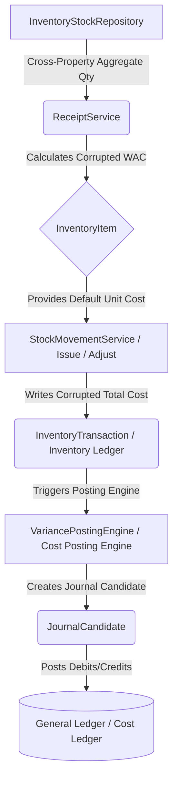

# Inventory Cost Control Trace Analysis

## Executive Summary
This document traces the financial blast radius of the scope bypass vulnerability identified in `InventoryStockRepository::totalQuantityForItemLocked()`. The objective is to determine if the `withoutGlobalScope('property')` query flaw propagates beyond the repository layer into enterprise financial ledgers. The analysis reveals a catastrophic, end-to-end contamination of the financial pipeline: from the initial receipt, through the Weighted Average Cost (WAC) calculation, into the immutable Inventory Ledger, and ultimately posting corrupted financial data directly into the General Ledger (Accounting).

## Financial Flow Diagram

## Findings

### Q1: Does ReceiptService use `totalQuantityForItemLocked()`?
**PASS / WARNING / FAIL:** **FAIL**
* **Finding:** Yes. The `ReceiptService` explicitly calls this method to retrieve the baseline quantity for its Weighted Average Cost (AVCO) calculation before posting a receipt.
* **Exact Reference:** `Modules/Operations/Inventory/Services/ReceiptService.php` Line 53
  * `$oldQty = (float) $this->stockRepository->totalQuantityForItemLocked($itemId);`

### Q2: Can cross-property inventory quantities influence AVCO/WAC calculation?
**PASS / WARNING / FAIL:** **FAIL**
* **Finding:** Yes. Because `totalQuantityForItemLocked()` bypasses the global property scope, `$oldQty` includes the physical stock of all properties in the entire database that share the given `item_id`. 
* **Exact Reference:** `ReceiptService.php` Line 88
  * `$newWac = (($oldQty * $oldWac) + $receiptValue) / $newTotalQty;`
* **Explanation:** The WAC calculation averages the new receipt's value against the massively inflated cross-property `$oldQty`. This mathematically guarantees the resulting `weighted_average_cost` stored on the `InventoryItem` is completely corrupted and inaccurate for the receiving property.

### Q3: Can contaminated WAC values enter Inventory Ledger?
**PASS / WARNING / FAIL:** **FAIL**
* **Finding:** Yes. The "Inventory Ledger" is represented by the `InventoryTransaction` model.
* **Exact Reference:** `Modules/Operations/Inventory/Services/StockMovementService.php` Lines 189 & 201-202.
  * `$costToUse = $unitCost ?? $item->weighted_average_cost;`
* **Explanation:** When an Issue or Adjustment occurs, the user typically does not provide a unit cost. The system falls back to the item's `weighted_average_cost`. The system writes this corrupted `$costToUse` and the derived `total_cost` directly into the immutable `InventoryTransaction` ledger.

### Q4: Can contaminated WAC values enter Cost Posting Engine?
**PASS / WARNING / FAIL:** **FAIL**
* **Finding:** Yes. The `VariancePostingEngine` acts as the financial translation layer (Cost Posting Engine) for inventory adjustments.
* **Exact Reference:** `Modules/Finance/GeneralLedger/Services/VariancePostingEngine.php` Line 33.
  * `$totalCost = abs((float) $transaction->total_cost);`
* **Explanation:** The posting engine consumes the `InventoryTransaction` payload directly. It blindly trusts the `total_cost` field, which was derived from the contaminated WAC, and stages it for financial posting.

### Q5: Can contaminated WAC values enter Cost Ledger?
**PASS / WARNING / FAIL:** **FAIL**
* **Finding:** Yes. The General Ledger (Cost Ledger) receives the final accounting entries.
* **Exact Reference:** `Modules/Finance/GeneralLedger/Services/VariancePostingEngine.php` Lines 89-102.
* **Explanation:** The posting engine creates `JournalCandidate` line items (Debits and Credits to `INVENTORY` and `INVENTORY_ADJUSTMENT_LOSS`/`GAIN`) using the corrupted `$totalCost`. These amounts finalize into the accounting ledger, directly impacting the Balance Sheet and Profit & Loss statements.

## Blast Radius Assessment
**Maximum Financial Blast Radius:** **Accounting (General Ledger)**
The contamination does not stop at the repository or the operational inventory. Because IVORQ utilizes an event-driven architecture bridging Operations to Finance, the mathematical corruption flows unimpeded through the `InventoryTransaction` ledger, into the `VariancePostingEngine`, and permanently settles as false Debits and Credits inside the enterprise General Ledger.

## Risk Classification
**Severity: Critical (P0 Blocker)**
* **ADR-001 Violation:** Cross-property data bleeding occurs synchronously during standard receiving workflows.
* **ADR-004 Violation:** Operations injects mathematically invalid financial valuations directly into Finance boundaries.
* **Audit Impact:** Any financial audit (e.g., SOC 1/2) will immediately fail the platform due to materially misstated financials.

## Recommended Remediation Order
1. **Repository Layer:** Immediately remove `withoutGlobalScope('property')` from `InventoryStockRepository::totalQuantityForItemLocked()`.
2. **Data Cleansing:** Identify all `InventoryItem` records where the WAC was updated since the bypass was introduced. Recalculate WAC per-property from the ground up using chronological receipt history.
3. **Ledger Correction:** Identify all `InventoryTransaction` and `JournalCandidate` lines created using the contaminated WAC. Issue reversing journal entries and repost the corrected values.

## Final Verdict
The architecture perfectly executes the integration flow (Operations → Ledger → Finance), but because the foundational repository bypassed multi-tenant isolation, the entire financial pipeline acts as a distribution mechanism for corrupted data. **Deployment must be halted until the root bypass is eliminated and historical WAC values are surgically recalculated.**
